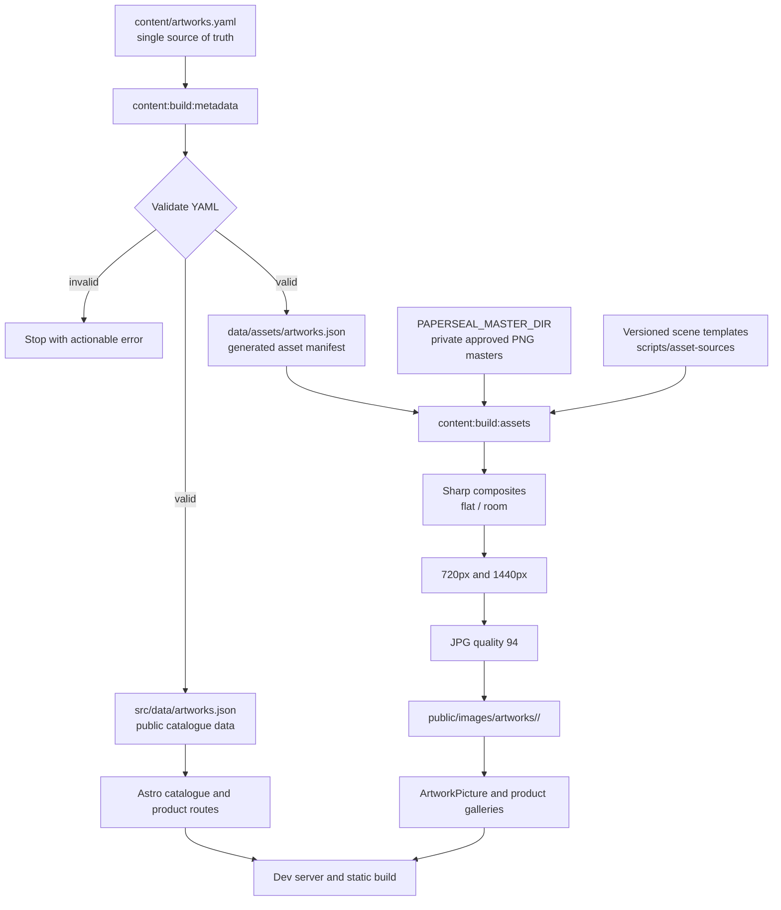

# Artwork content and asset workflow

`artworks.yaml` is the single editable source of truth for the Paperseal artwork catalogue.
It contains both public editorial metadata and the private configuration needed to build
display images from approved masters.

The generated JSON files and public image derivatives are build outputs. Do not edit them
manually.

## Pipeline



## Commands

From the repository root:

```sh
# Validate the YAML and generate both JSON manifests.
bun run content:build:metadata

# Generate public image derivatives from local private masters.
PAPERSEAL_MASTER_DIR=C:/path/to/approved-masters bun run content:build:assets

# Run both steps in order.
PAPERSEAL_MASTER_DIR=C:/path/to/approved-masters bun run content:build
```

On Windows PowerShell, set the master directory for the current session first:

```powershell
$env:PAPERSEAL_MASTER_DIR = 'C:\path\to\approved-masters'
bun run content:build
```

`PAPERSEAL_MASTER_DIR` must point to a local directory containing every `masterFile` named
in `artworks.yaml`. Production masters are not committed or served by the site.

## What each step does

1. `content:build:metadata` parses and validates the YAML, checks scene templates, and
   writes `src/data/artworks.json` plus `data/assets/artworks.json`.
2. `content:build:assets` reads the generated asset manifest, loads masters from
   `PAPERSEAL_MASTER_DIR`, composes `flat` and `room` variants, and writes four JPG
   derivatives per artwork: two variants × two widths.
3. Astro reads the generated catalogue metadata and serves the generated derivatives from
   `public/images/artworks/`.

The asset writer retries individual Sharp writes because large image processing can expose
transient Windows filesystem or antivirus locks. The retry protects local regeneration; it
does not replace the requirement for enough free disk space and memory.

## Current catalogue

The current catalogue contains 17 artworks. Editorial titles, descriptions, and ordering
can be refined later by editing only `artworks.yaml` and rerunning the metadata build.
# Editorial copy workflow

Page and interface copy lives in `content/copy/en-GB`. The locale directory is explicit: there is no implicit fallback, and a future locale must provide its own validated files.

## Editing

Use the shared file for navigation, footer and labels used in more than one page. Use a page/domain file for copy owned by that experience. Product titles, descriptions, alt text and commercial data remain in the artwork/product models.

YAML values are plain text. Use `\n` for intentional line breaks. Links must remain declared by the consuming component; do not add HTML or executable content to YAML. State variants belong in the content file while selection logic remains in TypeScript.

## Review

After editing YAML:

1. Run `npm run test -- src/content/copy.test.ts`.
2. Run `npm run dev` and review the affected route in the browser.
3. Run `npm run validate` before handoff.

Missing required keys, invalid types and invalid URL structures fail validation. Editorial warnings should be visible in validation output but must not silently change rendered copy.

## Format decision

YAML was selected over JSON for readable manual editing, over TypeScript for lower editorial friction, and over Astro Content Collections because this copy is a typed application input rather than long-form document content. A hybrid domain/page layout avoids both one oversized catalogue and component-level fragmentation.
